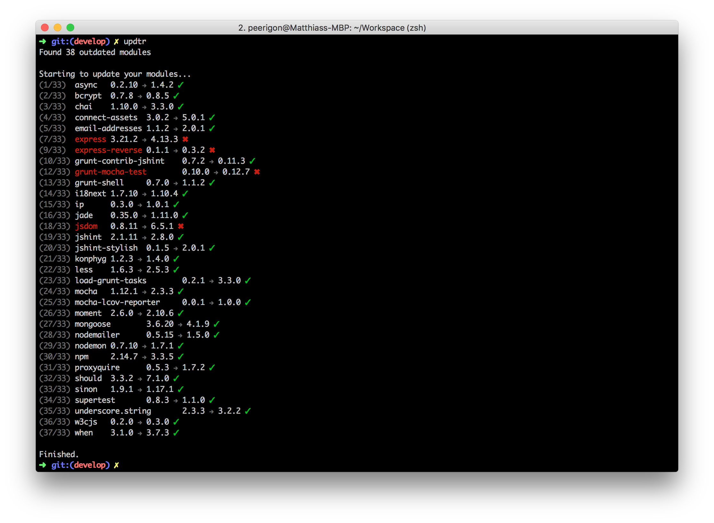

# updtr

**Update outdated npm modules with zero pain**

Based on `npm outdated`, **updtr** installs the latest version and runs `npm test` for each dependency. If the test succeeds, **updtr** saves the new version number to your `package.json`. If the test fails, however, **updtr** rolls back its changes.

## Installation

[]
(https://npmjs.org/package/updtr)

## License

Unlicense