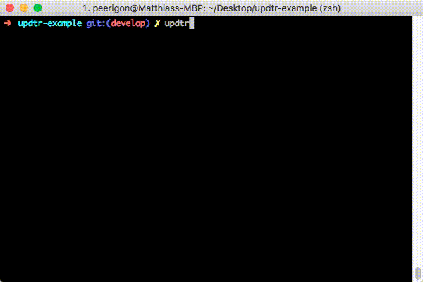

# updtr

**Update outdated npm modules with zero pain™**

[](https://travis-ci.org/peerigon/updtr)
[](https://www.npmjs.com/package/updtr)
[](https://www.npmjs.com/package/updtr)
[](https://coveralls.io/github/peerigon/updtr?branch=master)

Based on `npm outdated`, **updtr** installs the latest version and runs `npm test` for each dependency. In case the test succeeds, **updtr** saves the new version number to your `package.json`. Otherwise, **updtr** rolls back the conflicting update.

Additionally, it will use `yarn` instead of `npm` when a `yarn.lock` file is present in your project.

Made by [Peerigon](https://peerigon.com/?pk_campaign=gh-os&pk_kwd=updtr).



## Installation

```
npm install -g updtr
```

## Options

### `--use` `-u`

Specify the package manager to use:

- `npm`
- `yarn`

Updtr tries to guess the package manager by looking for a `yarn.lock` file. If there is one in `process.cwd()`, it will use yarn. Setting this option overrides that default.

### `--exclude` `--ex`

Space separated list of module names that should not be updated.

### `--update-to` `--to`

- `latest` *(default)*: update all packages to the latest version number
- `non-breaking`: update all packages to the latest version number that does not conflict with the installed version number
- `wanted`: update all packages to the latest version number that does not conflict with the version number as specified in the `package.json`

### `--save` `-s`

Specify how updated versions should be saved to the `package.json`:

- `smart` *(default)*: tries to preserve the current style. Falls back to `caret` if the style cannot be preserved.
- `caret`: saves `^x.y.z`
- `exact`: saves `x.y.z`

### `--reporter` `-r`

Choose a reporter for the console output:

- `dense` *(default*): See screenshot
- `basic` : Use simple console.log, no need of a TTY (ex: on CI)
- `none`: No console output

### `--test` `-t`

Specify a custom test command. Surround with quotes:

`updtr -t "mocha -R spec"`

### `--test-stdout` `--out`

Show test stdout if the update fails.

### `--registry` `--reg`

Specify a custom registry to use.

**Please note:** yarn does not support to set a custom registry via command line. Use a `.npmrc` file to achieve this. See also [yarnpkg/yarn#606](https://github.com/yarnpkg/yarn/issues/606).

### `--version`

Show the current updtr version.

### `--help`

Show all commands.

## License

Unlicense

## Sponsors

[](https://peerigon.com)
